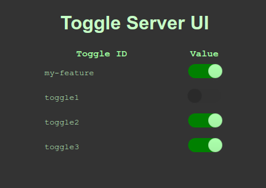

# Toggle Server

Primitive UI



TODO:
- Research in-memory db solution
- build this out...
    - ~~server with REST~~
    - ~~api-java-rest~~
        1. ~~val from REST~~
        2. ~~val from application.properties~~
        3. ~~val default false~~
        - ~~get serverUri from properties file~~
    - ~~Add SSE impl to server~~
    - ~~api-java-sse~~
        1. ~~val from cache~~
        2. ~~val from application.properites~~
        3. ~~val default false~~
        - ~~get serverUri from properties file~~
        - ~~retry server connection on lost connection~~
        - ~~update cache on SSE update~~
    - db integration
        - in-memory db solution
        - persistent db solution with cold-start
    - UI for management
        - ~~consume SSE events for toggle updates~~
        - ~~show toggle list and current value~~
        - impl auth
        - impl roles/permissions
        - impl change audits
    - tests
    - jacoco coverage
    - code quality
    - get logger working in cargo container
- ~~doc dev workflow~~
- ~~doc java api usage~~
- doc toggle-server usage
- javadoc on ToggleClient

## Client Usage

build.gradle (assumes you have published the desired api artifacts to an accessible repo, or include locally with gradle composite builds)
```gradle
plugins {
    id 'java'
}

repositories {
    jcenter()
    // and/or some other valid repo
}

dependencies {
    implementation 'org.featuretoggle.client:api-java-sse:1.0.0'
}
```

application.properties
```properties
# default value for your feature toggle(s)
my-feature=false
wip-feature-123=true

# hostname that ToggleClient queries
toggleServerUri=http://localhost:8090
```

SampleJava.java
```java
import org.featuretoggle.client.ToggleClient;

public class SampleJava {
    public static void main(String[] args) {
        if (ToggleClient.isFeatureEnabled("my-feature")) {
            // do something
        } else {
            // do something else
        }
    }
}
```

## UI Run Local

### Option 1 (fast dev)

Allows file-watching for ui changes; No rebuilds needed.

Startup the toggler server:

```bash
toggle-server $ ./gradlew bootRun
```

Startup the ui:

```bash
toggle-server/ui $ npm start
```

### Option 2 (slow dev)

Runs everything built together; No file watching; Requires rebuilds per change.

Startup all-in-one toggle-server + ui:

```bash
toggle-server $ ./gradle cargoRunLocal -i
```